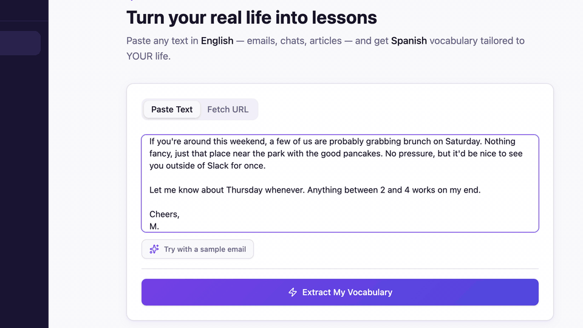
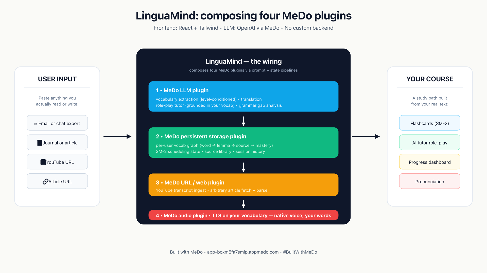

# LinguaMind — AI Language Coach

> **Your life is the syllabus.** Paste any text you actually read — emails, articles, song lyrics, messages from friends abroad — and LinguaMind turns it into a personalized vocabulary course with a role-play tutor that forces you to use the new words. Built end-to-end on [MeDo](https://medo.dev/) by composing four plugins.

[**Try the live demo →**](https://app-boxm5fa7smip.appmedo.com/) &nbsp;&nbsp;|&nbsp;&nbsp; [**Devpost submission →**](https://devpost.com/software/linguamind-ai-language-coach) &nbsp;&nbsp;|&nbsp;&nbsp; [**Demo video (2 min) →**](https://youtu.be/BrVGe8CXT3o)

---

## Why this exists

Most language apps drill the same 2,000 generic words from a frequency list — useful at A1, useless once you can read real material. The well-documented "intermediate plateau" hits learners hard around B1/B2: the generic curriculum stops mapping onto anything they actually want to read or say. (Richards, 2008, *Moving Beyond the Plateau* documents this in second-language acquisition research; [Krashen's comprehensible-input hypothesis](https://en.wikipedia.org/wiki/Input_hypothesis) frames the same thing from a different angle — learning happens when the input is *just beyond* current ability, on material the learner cares about, not at a generic level chosen by a curriculum designer.)

LinguaMind flips the unit of curriculum from "next word on the frequency list" to "the next word that appeared in something you actually read this week."

## What it does

1. **Paste a real-world text.** An article, an email, a song lyric, a transcript from a YouTube video your friend sent you.
2. **Get a level-conditioned course.** LinguaMind extracts up to 8 vocabulary candidates — calibrated against the words you already know — with a one-line gloss and the sentence each word appeared in.
3. **Drill on flashcards using SM-2 spaced repetition.** The same algorithm that makes Anki work, but the cards are *your* words.
4. **Role-play a scene with an AI tutor that has to use your new words.** Café, debate, first date, airport. The tutor speaks only in your target language; corrections come back in-character without breaking the scene.
5. **Hear the role-play aloud.** Audio plugin reads the dialogue with target-language pronunciation.

Today: Spanish, German, French, Italian, Portuguese, Mandarin, Japanese, Korean.

## Architecture

LinguaMind is a four-plugin composition on MeDo's platform — no traditional backend, no Dockerfiles, no servers.

| Plugin | What it does in LinguaMind |
|---|---|
| **LLM** | Vocabulary extraction (level-conditioned), role-play tutor, grammar gap analysis |
| **Persistent storage** | Per-user vocab graph (word, lemma, source sentence, mastery state), SM-2 scheduling state, source library |
| **URL / web** | Fetches and cleans article text when the user gives a link instead of pasting |
| **Audio** | Text-to-speech for role-play dialogue and individual word pronunciation |

The load-bearing trick is the **level-conditioning loop** (storage → LLM → storage). Without it, the LLM regresses to a generic frequency-list-shaped output. Conditioning each extraction call on a sample of words the user already knows is what makes the same text yield different vocab for an A2 learner vs. a B2 learner. See [ARCHITECTURE.md](./ARCHITECTURE.md) for the call graph.

## How it's built

This repository is not a source tree — LinguaMind runs end-to-end on MeDo's no-code/low-code plugin platform. What this repo contains is the **design**: the architecture, the prompt design, the trade-offs. The production prompt text is intentionally not published ([why](./NOTICE.md)).

## What's in this repo

- [`README.md`](./README.md) — this file
- [`ARCHITECTURE.md`](./ARCHITECTURE.md) — the four-plugin composition in technical detail
- [`PROMPTS.md`](./PROMPTS.md) — prompt design (description of what each prompt does; text not published)
- [`NOTICE.md`](./NOTICE.md) — copyright, trademark, and what you may / may not do with this design
- [`LICENSE`](./LICENSE) — Apache 2.0 for documentation and code snippets
- [`assets/`](./assets/) — hero GIF and architecture diagram

## License & attribution

Documentation and code snippets in this repository are licensed under Apache License 2.0 — see [`LICENSE`](./LICENSE). The **production prompts**, the **name "LinguaMind"**, and the **logo / product trade dress** are not licensed under Apache 2.0 — see [`NOTICE.md`](./NOTICE.md) for details.

If you build something inspired by this design, that's great — please do it under your own brand.

Author: Mick Johnson ([@mick-jae-johnson](https://github.com/mickolasjae))

Built for the [**MeDo Hackathon 2026**](https://medo.devpost.com) — `#BuiltWithMeDo`
